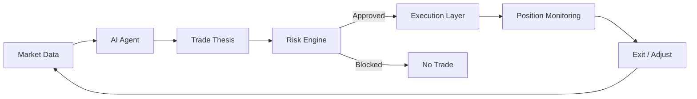

# SIN.AI Documentation

## Autonomous intelligence for the markets.

SIN.AI is being built around **autonomous trading agents** — intelligent software agents designed to observe markets, reason over signals and context, propose or execute trading actions within defined permissions, and continuously monitor risk.

The objective is not uncontrolled automation. The system is designed around a clear separation between **intelligence**, **risk authorization**, and **execution**.


**Development status:** SIN.AI is under active development. Capabilities are documented as **Live**, **Beta**, **In Development**, or **Planned**. Exchange support, strategy availability, tokenomics, contract addresses and launch parameters are only presented as live when they are finalized and verifiable.


## The SIN.AI trading system

The agent can identify an opportunity, but **the decision to act is constrained by permissions and risk controls**. A useful signal does not automatically become an order.

## Explore the core product

<table data-view="cards"><thead><tr><th></th><th></th><th></th><th data-hidden data-card-target data-type="content-ref"></th></tr></thead><tbody><tr><td><h3><i class="fa-robot">:robot:</i></h3></td><td><strong>Trading Agents</strong></td><td>Meet the core product layer: autonomous agents designed for market analysis, governed decisions and trading workflows.</td><td></td></tr><tr><td><h3>↻</h3></td><td><strong>How Agents Trade</strong></td><td>Follow the complete trading loop from observation and analysis through risk validation, execution and monitoring.</td><td></td></tr><tr><td><h3><i class="fa-shield-halved">:shield-halved:</i></h3></td><td><strong>Risk Engine</strong></td><td>See how exposure, permissions and execution constraints are designed to sit between AI reasoning and the exchange.</td><td></td></tr><tr><td><h3>◉</h3></td><td><strong>Inside the Agent</strong></td><td>A transparency layer showing what an agent can observe, decide, request and execute — and where its authority stops.</td><td></td></tr></tbody></table>

## Why the architecture matters


{% column width="50%" %}
### Intelligence

Agents can combine market observations, strategy logic, contextual information and tool access to form a trade thesis.

The AI layer answers: **What appears worth doing?**


{% column width="50%" %}
### Control

The risk and execution layers determine whether a proposed action is permitted, within limits and eligible for execution.

The control layer answers: **What is actually allowed to happen?**



## Built around four operating principles

| Principle          | What it means                                                                                          |
| ------------------ | ------------------------------------------------------------------------------------------------------ |
| **Agent-native**   | Autonomous agents are the primary product layer, not a cosmetic AI add-on.                             |
| **Risk-gated**     | Trade intent is evaluated against explicit controls before execution.                                  |
| **Transparent**    | Product status, permissions and on-chain claims should be independently understandable and verifiable. |
| **Human-governed** | Users retain control over permissions, limits and consequential actions.                               |

## Beyond trading

SIN.AI is designed as a broader AI-agent ecosystem. Trading is the flagship use case, while the underlying architecture can support research, analysis, workflow automation, integrations and future on-chain interactions.

<table data-view="cards"><thead><tr><th></th><th></th><th></th><th data-hidden data-card-target data-type="content-ref"></th></tr></thead><tbody><tr><td><h3>◎</h3></td><td><strong>Overview</strong></td><td>Product thesis, design principles and documentation model.</td><td></td></tr><tr><td><h3>◇</h3></td><td><strong>Architecture</strong></td><td>The intelligence, orchestration, integration and blockchain layers behind SIN.AI.</td><td></td></tr><tr><td><h3>⬡</h3></td><td><strong>Built on Base</strong></td><td>Planned blockchain infrastructure and the verification model for official deployments.</td><td></td></tr><tr><td><h3>⌁</h3></td><td><strong>Security &#x26; Transparency</strong></td><td>Security boundaries, contract transparency and verification standards.</td><td></td></tr></tbody></table>

## Join the SIN.AI community

Connect with SIN.AI through our official community channels. These profiles are being prepared and will be linked here once they are live and verified.


{% column width="33%" %}
### <i class="fa-discord">:discord:</i> ◉ Discord

Community discussions, product updates and support.

**Status:** Coming soon


{% column width="33%" %}
### <i class="fa-telegram">:telegram:</i> ◉ Telegram

Fast updates, announcements and community conversation.

**Status:** Coming soon


{% column width="34%" %}
### <i class="fa-x-twitter">:x-twitter:</i> ◉ X / Twitter

Official news, releases and ecosystem updates.

**Status:** Coming soon




Only links published in this documentation or other verified SIN.AI channels should be treated as official.



**Official verification matters.** Never rely on an unverified token contract, treasury address, performance claim, liquidity claim or audit claim. Official deployment information will be documented here once available.

