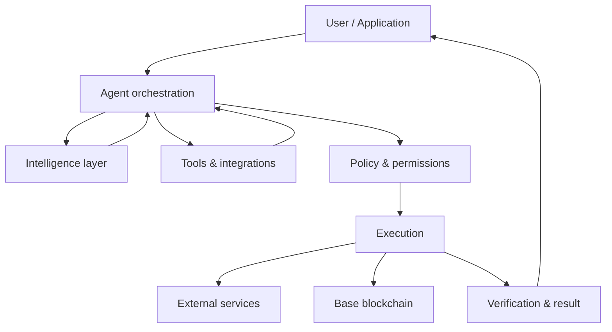

# Architecture

QAA SI is designed as a layered system so that intelligence, application logic, authorization and blockchain execution can evolve independently.

## 1. Intelligence layer

Coordinates language models, task reasoning, contextual retrieval and agent-specific instructions. Model output is treated as a decision input, not as an authorization primitive.

## 2. Agent orchestration

Maintains objectives, task state, tool selection, retries, intermediate results and workflow progression.

## 3. Tools & integrations

Agents can be extended through explicitly authorized APIs, applications and data sources. Every integration should define the data it can access and the actions it can perform.

## 4. Policy & permissions

The policy layer determines whether a proposed action is allowed, requires confirmation or must be blocked. This boundary is especially important for wallets, credentials and external side effects.

## 5. Blockchain layer

QAA SI is planned around **Base** for blockchain infrastructure. On-chain components may include token functionality, smart-contract interactions, treasury operations and other ecosystem mechanisms once finalized.

## Security boundary

| Decision                              | Responsible layer        |
| ------------------------------------- | ------------------------ |
| What action could solve the task?     | Agent reasoning          |
| Which tool could perform it?          | Orchestration            |
| Is the action permitted?              | Policy / authorization   |
| Was the action executed successfully? | Execution + verification |

This separation reduces the risk of treating model output as an unrestricted command channel.
