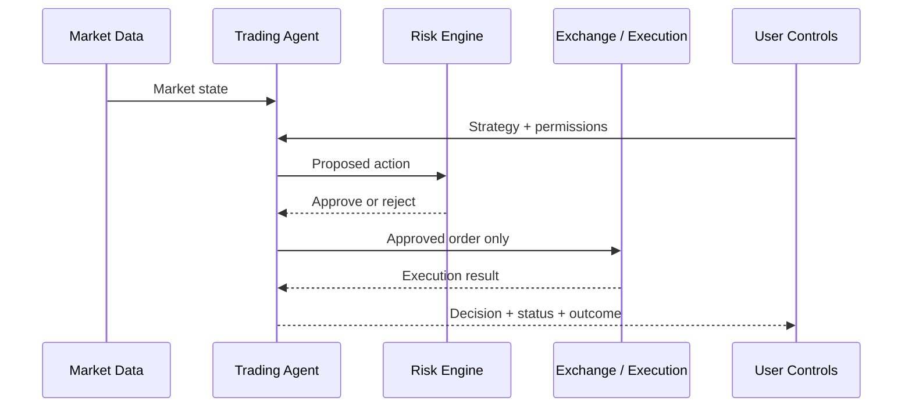

# How Agents Trade

A professional autonomous trading system should make the path from information to action understandable. SIN.AI is therefore designed around a staged trading loop rather than a single opaque model output.



### 1. Observe

The agent receives only the market data, account context, and external signals that its configuration permits.



### 2. Build a trade thesis

The agent evaluates the available evidence against its strategy rules and forms a candidate action such as **no trade**, **enter**, **reduce**, **exit**, or **adjust**.



### 3. Validate risk

Before execution, the proposed action is checked against hard constraints such as position limits, exposure limits, account permissions, and other configured controls.



### 4. Execute

Only an approved action reaches the execution layer. The execution layer should use the minimum account permissions needed for trading.



### 5. Monitor

After execution, the agent continues to track market conditions, the position state, and relevant risk thresholds.



### 6. Exit or adapt

The agent evaluates whether to hold, reduce, close, or otherwise adjust the position according to its permitted policy.



## A decision is more than a signal

## No-trade is a valid decision

An autonomous agent should not be forced to trade. If conditions are weak, data is insufficient, risk limits are reached, or permissions do not allow an action, **no trade** is a valid and often necessary outcome.


Autonomous trading does not remove market risk. AI models can be wrong, market conditions can change quickly, and execution can differ from expected results.


[See the controls that can block or constrain an action →](risk-engine.md)
