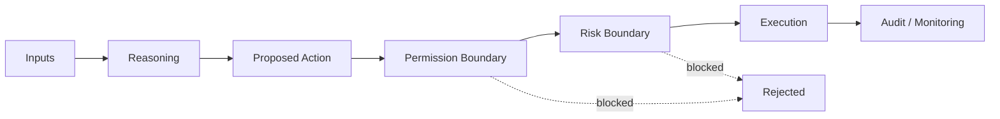

# Inside the Agent

**Inside the Agent** is the transparency layer of the SIN.AI documentation. Instead of presenting an AI agent as a black box, this section defines the boundaries between information, reasoning, permission, risk, and execution.

## The five boundaries

<table data-view="cards"><thead><tr><th></th><th></th><th></th></tr></thead><tbody><tr><td><i class="fa-eye">:eye:</i></td><td><strong>What it can see</strong></td><td>Only data sources, account context, and tools explicitly exposed to the agent.</td></tr><tr><td><i class="fa-brain">:brain:</i></td><td><strong>What it can decide</strong></td><td>The agent may form a thesis and propose actions within its configured strategy.</td></tr><tr><td><i class="fa-lock">:lock:</i></td><td><strong>What it can request</strong></td><td>Actions can be passed to permission and risk controls for approval.</td></tr><tr><td><i class="fa-bolt">:bolt:</i></td><td><strong>What it can execute</strong></td><td>Only approved operations supported by the connected execution layer.</td></tr><tr><td><i class="fa-ban">:ban:</i></td><td><strong>What it cannot do</strong></td><td>Actions outside permissions, blocked by risk controls, or unsupported by the system.</td></tr></tbody></table>

## Agent decision envelope

## What users should be able to inspect

Where technically available, a transparent agent experience can expose the key context around an action without revealing private chain-of-thought reasoning. Useful artifacts include:

* The strategy or agent profile involved
* The market and asset evaluated
* The action requested
* Relevant risk checks and whether they passed
* The execution status
* Order or transaction identifiers where applicable
* Position state and subsequent actions

## Why this matters

Autonomous systems become easier to trust when their **boundaries and outputs are inspectable**, even when the underlying model reasoning is not exposed verbatim.


The objective is accountable autonomy: agents that can operate independently inside clearly defined rules, while users retain visibility and control over consequential actions.


## Future transparency features

Potential future additions can include agent activity timelines, risk-event histories, execution receipts, strategy versioning, and per-agent status dashboards. These should only be documented as live features once implemented and verified.
