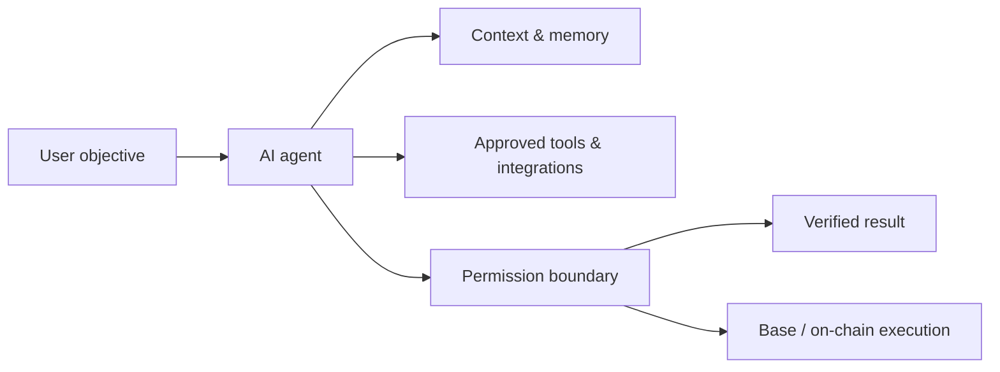

# QAA SI — Overview

QAA SI is being designed as an AI-agent ecosystem that combines intelligent autonomous software with blockchain-based infrastructure on Base.

The project is structured so that product capabilities, technical architecture, token mechanics and security controls can be documented independently and verified as they mature.

## What QAA SI is designed to enable

* **Specialized AI agents** for research, analysis, automation and digital workflows.
* **Tool-enabled execution** through explicitly authorized APIs, integrations and services.
* **Permission-aware operations** so reasoning and execution remain separate security boundaries.
* **On-chain infrastructure** for transparent ownership, settlement and ecosystem mechanisms.
* **Verifiable documentation** for contracts, treasury controls, vesting, liquidity and audits when deployed.

## Product model

An agent may determine that an action is useful, but consequential execution remains subject to authorization and system policy.

## Documentation model

| Status             | Meaning                                                                            |
| ------------------ | ---------------------------------------------------------------------------------- |
| **Live**           | Available in production and documented as currently usable.                        |
| **Beta**           | Available in a limited or evolving production form.                                |
| **In Development** | Actively being built or tested; not represented as generally available.            |
| **Planned**        | Part of the intended architecture or roadmap, without a production commitment yet. |


Tokenomics, contract addresses, vesting schedules, liquidity details and other launch parameters are intentionally omitted until they are finalized and verifiable.


## Core principles

**AI-native.** Agents are designed as the core product layer rather than an add-on.

**On-chain capable.** Blockchain interactions are designed around Base infrastructure.

**Transparent.** Material token, treasury, vesting and liquidity information should be independently verifiable when deployed.

**Security-conscious.** Agent permissions, smart-contract controls and wallet interactions are documented explicitly.

**Utility-focused.** Token functionality will be tied to defined ecosystem functions rather than unsupported promises.
