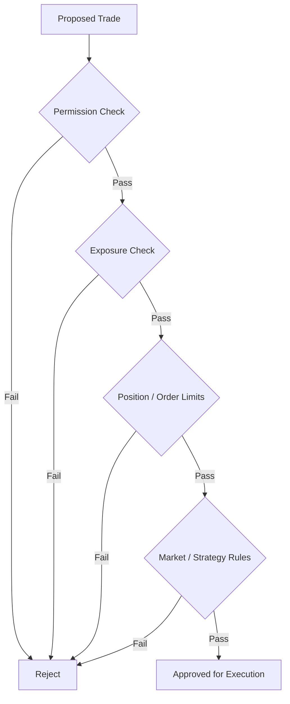

# Risk Engine

The Risk Engine is intended to act as an independent control boundary between an agent's trading decision and execution.

The core principle is simple: **an agent may identify an opportunity without automatically being allowed to act on it.**

## Control categories

| Control                  | Purpose                                                         |
| ------------------------ | --------------------------------------------------------------- |
| Account permissions      | Restrict what an agent is allowed to do on a connected account. |
| Position limits          | Cap the size of a single position or order.                     |
| Portfolio exposure       | Constrain aggregate risk across positions or assets.            |
| Asset / venue allowlists | Restrict trading to approved markets or exchanges.              |
| Strategy constraints     | Prevent actions outside the configured trading policy.          |
| Emergency controls       | Pause or disable trading when predefined conditions are met.    |

## Hard limits vs. agent judgment

Risk controls should not rely only on model judgment. Where possible, critical rules should be enforced as deterministic constraints outside the reasoning layer.


{% column width="50%" %}
### Agent judgment

Useful for interpreting market context, weighing evidence, and proposing an action.


{% column width="50%" %}
### Hard controls

Useful for permissions, exposure ceilings, forbidden actions, account-level limits, and emergency shutdown behavior.



## Emergency stop

A mature deployment should provide a clear way to stop new trading activity. The exact implementation — for example user pause, account disconnect, policy lock, or automated circuit breaker — will be documented once finalized.


A risk engine reduces operational risk; it cannot eliminate trading losses, model errors, exchange failures, slippage, or extreme market events.


See what happens inside the agent before and after the risk check →
