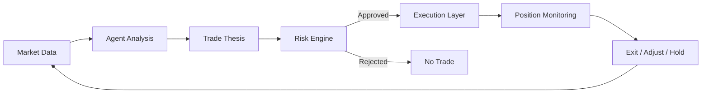

# Trading Agents

SIN.AI is being designed around autonomous trading agents that can monitor markets, interpret data, evaluate opportunities, and execute approved trading workflows within explicit risk and permission boundaries.


**Product status:** This page describes the intended SIN.AI trading-agent architecture. Specific exchanges, strategies, assets, execution venues, and production capabilities should be marked **Live**, **Beta**, **In Development**, or **Planned** as they are verified.


## What makes an agent autonomous?

An autonomous trading agent is not simply a signal generator. It is designed to move through a controlled decision loop: observe, analyze, decide, validate, execute, and monitor.

## Core responsibilities

<table data-view="cards"><thead><tr><th></th><th></th><th></th></tr></thead><tbody><tr><td><i class="fa-magnifying-glass">:magnifying-glass:</i></td><td><strong>Observe</strong></td><td>Continuously evaluate permitted market data and relevant context.</td></tr><tr><td><i class="fa-brain">:brain:</i></td><td><strong>Reason</strong></td><td>Form a trade thesis using the agent's configured strategy and available evidence.</td></tr><tr><td><i class="fa-shield-halved">:shield-halved:</i></td><td><strong>Validate</strong></td><td>Send proposed actions through portfolio, permission, and risk checks before execution.</td></tr><tr><td><i class="fa-bolt">:bolt:</i></td><td><strong>Execute</strong></td><td>Place only actions that are allowed by the configured execution policy.</td></tr><tr><td><i class="fa-satellite-dish">:satellite-dish:</i></td><td><strong>Monitor</strong></td><td>Track the position and react to changing conditions, limits, or exit criteria.</td></tr><tr><td><i class="fa-clipboard-list">:clipboard-list:</i></td><td><strong>Explain</strong></td><td>Record the relevant decision context so users can understand what the agent did and why.</td></tr></tbody></table>

## Agent profiles

SIN.AI can support specialized agents rather than forcing every strategy into one model. Potential profiles can include market scanning, trend following, mean reversion, portfolio coordination, execution, and risk oversight.

Exact agent profiles will only be listed as product capabilities once their behavior, permissions, supported markets, and status are confirmed.

## Human control

Autonomy should remain bounded. Users should retain control over which accounts an agent can access, which actions it can perform, what capital it may use, and when trading must stop.

See how an agent moves from market data to execution →
